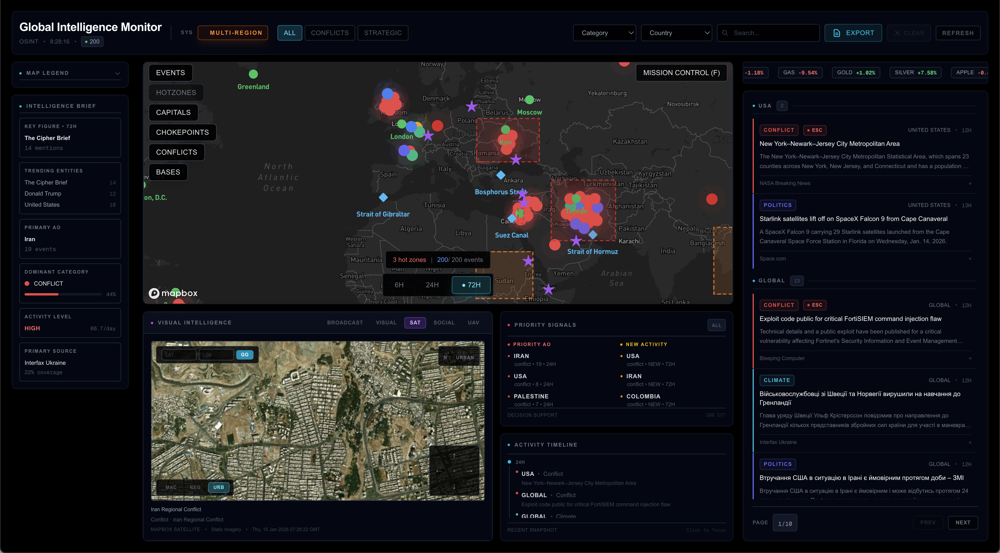

# Global OSINT Monitor

**Real-time intelligence platform for global situational awareness through open-source intelligence**

## Overview

Global OSINT Monitor is an **intelligence-grade web platform** designed to transform fragmented public information into coherent, actionable intelligence. Rather than functioning as a traditional news aggregator, it provides structured event intelligence with automated threat assessment, geospatial analysis, and professional briefing generation.

The platform serves **OSINT analysts, security professionals, researchers, and strategic monitoring teams** who need to move from raw information to informed insight with minimal friction.



---

## Core Capabilities

### **Real-Time Situational Awareness**
Continuous monitoring and visualization of global events across multiple intelligence domains:
- Military Operations & Conflicts
- Political Developments
- Economic Disruptions
- Cyber Operations
- Terrorism & Security Threats
- Energy & Infrastructure
- Space & Technology
- Natural Disasters

### **Automated Threat Assessment**
Intelligence-grade analysis engine that generates:
- **Threat Level Classification** (LOW → CRITICAL)
- **Pattern Recognition**: Emerging trends and multi-domain operations
- **Geographic Hotspot Detection**: Activity concentration analysis
- **Temporal Trend Analysis**: Escalation and de-escalation tracking
- **Risk Assessment**: Strategic impact evaluation
- **Tactical Recommendations**: Actionable intelligence outputs

### **Global State Evaluation (GSE)**
Proprietary algorithm that assesses overall global stability through:
- Regional pressure analysis
- Cross-domain activity correlation
- Confidence-weighted scoring
- Historical baseline comparison

### **Interactive Geospatial Intelligence**
Advanced mapping system with:
- Real-time event clustering
- Heat map visualization
- Satellite imagery integration
- Tactical focus modes (UAV simulation)
- Geographic correlation analysis

### **Professional Briefing Generation**
Automated intelligence report creation with:
- **Executive Summary**: AI-generated analysis with methodology
- **Threat Assessment**: 5-level classification system
- **Event Categorization**: Structured by domain and priority
- **Source Attribution**: Full citation and verification
- **Export to PDF**: Professional, print-ready intelligence reports
- **UNCLASSIFIED** marking (OSINT-appropriate)

### **Mission Control Interface**
Dedicated analytical workspace featuring:
- **New & Escalating Events Panel**: Priority signal detection
- **Focus Timeline**: Temporal pattern analysis
- **Market Indicators**: Economic context correlation
- **Visual Panels**: Satellite and UAV perspective views
- **Adaptive Filtering**: Category, country, and search-based refinement

---

## Intelligence Workflow

```
┌─────────────────────────────────────────────────────┐
│ 1. COLLECTION                                       │
│    Open-source news aggregation from global media   │
└─────────────────┬───────────────────────────────────┘
                  │
┌─────────────────▼───────────────────────────────────┐
│ 2. PROCESSING                                       │
│    Event extraction, classification, geolocation    │
└─────────────────┬───────────────────────────────────┘
                  │
┌─────────────────▼───────────────────────────────────┐
│ 3. ANALYSIS                                         │
│    Pattern detection, threat assessment, GSE calc   │
└─────────────────┬───────────────────────────────────┘
                  │
┌─────────────────▼───────────────────────────────────┐
│ 4. VISUALIZATION                                    │
│    Map, timeline, panels, mission control           │
└─────────────────┬───────────────────────────────────┘
                  │
┌─────────────────▼───────────────────────────────────┐
│ 5. DISSEMINATION                                    │
│    Briefing generation, PDF export, sharing         │
└─────────────────────────────────────────────────────┘
```

---

## Key Features

### **Automated Intelligence Collection**
- Multi-source event ingestion
- Real-time processing pipeline
- Duplicate detection and merging
- Source verification

### **AI-Powered Analysis**
- Automated threat level calculation
- Emerging pattern detection
- Geographic clustering algorithms
- Temporal trend identification
- Multi-domain correlation

### **Focus & Priority System**
- **Hot Zones**: Areas requiring immediate attention
- **New Activity**: First-time or re-emerging signals
- **Escalation Detection**: Activity intensity monitoring
- **Focus Propagation**: Cross-panel analytical linking

### **Intelligence Dashboards**
- **Global State Indicator**: Overall situation assessment
- **Category Distribution**: Domain-specific breakdowns
- **Geographic Heat Maps**: Spatial concentration analysis
- **Temporal Timelines**: Event sequencing and patterns

### **Professional Briefing System**
- **Configurable Exports**: Time window, countries, categories
- **Executive Summary**: Key findings, patterns, risks
- **Source Citations**: Full attribution for every event
- **PDF Generation**: Print-ready intelligence reports
- **Shareable Links**: Collaborative analysis support

### **Advanced Filtering**
- Category-based filtering
- Country-specific views
- Text search across all events
- Preset analytical focuses (Conflicts, Strategic)
- Combined filter modes

---

## Technology Stack

### Frontend
- **Framework**: Next.js 14 (App Router)
- **Language**: TypeScript
- **Styling**: Tailwind CSS
- **Mapping**: Mapbox GL JS
- **Charts**: Recharts
- **PDF Generation**: jsPDF + jspdf-autotable

### Backend
- **API**: Next.js API Routes (serverless)
- **Database**: JSON-based event store (extensible)
- **Deployment**: Vercel (edge network)

### Intelligence Engine
- **GSE Algorithm**: Custom global state evaluation
- **Pattern Detection**: Statistical clustering
- **Threat Assessment**: Multi-factor analysis
- **Source Processing**: Text extraction and classification

---

## Usage Guide

### **Mission Control (Desktop)**
The primary analytical interface for comprehensive monitoring:

1. **Header**: Global state, presets, filters, export
2. **Left Sidebar**: Legend, category insights
3. **Center Map**: Interactive geospatial view
4. **Right Panel**: Event feed with live updates
5. **Bottom Panels**: Visual context (satellite/UAV), signals (new/escalating), timeline

**Reading Order**: Status → Map → Signals → Timeline → Feed

### **Map View (Mobile)**
Simplified touch-optimized interface:
- Full-screen interactive map
- Bottom sheet with event list
- Swipe gestures for navigation
- Filter drawer for refinement

### **Briefing Generator**
Create professional intelligence reports:

1. Click **"Export"** in header
2. Configure briefing parameters:
   - Time window (6h / 24h / 72h)
   - Countries (multi-select)
   - Categories (multi-select)
   - Additional components (signals, hot zones, timeline)
3. Review configuration and event count
4. Generate briefing (opens in new window)
5. Export to PDF for distribution

**Briefing Includes:**
- Classification header (UNCLASSIFIED)
- Executive summary with methodology
- Threat assessment (5 levels)
- Key findings and emerging patterns
- Risk evaluation by domain
- Tactical recommendations
- Detailed event listings with sources
- Geographic distribution analysis
- Data source attribution
- Professional disclaimer

---

## Intelligence Methodology

### Event Classification
Events are categorized using a multi-factor system:
- **Domain**: Primary area of impact
- **Severity**: Assessed impact level
- **Geographic Scope**: Local, regional, or global
- **Temporal Relevance**: Ongoing vs historical

### Threat Assessment Levels
```
CRITICAL  >80% conflict ratio OR >50% terrorism ratio
HIGH      >60% conflict ratio OR >30% terrorism ratio  
ELEVATED  >40% conflict ratio OR >20% terrorism ratio
MODERATE  Default baseline state
LOW       Minimal detected activity
```

### Pattern Detection
Automated identification of:
- **Multi-domain operations**: ≥5 active categories
- **Regional instability**: Conflict ratio >30%
- **Cyber escalation**: >5 cyber events
- **Temporal acceleration**: Recent activity >60% of total

### Global State Evaluation (GSE)
Proprietary algorithm calculating:
```
GSE Score = Σ(Regional Pressure × Domain Weight × Recency Factor)

Where:
- Regional Pressure = Event count × Severity
- Domain Weight = Category criticality (conflict=1.5, terrorism=1.3, etc.)
- Recency Factor = Time decay function
```

**States:**
- **STABLE** (GSE < 30): Normal activity levels
- **ELEVATED** (30-60): Increased monitoring required
- **HEIGHTENED** (60-90): Significant activity detected
- **CRITICAL** (>90): Major crisis or multiple concurrent events

---

## Project Structure

```
global-osint-monitor/
├── app/
│   ├── page.tsx              # Mission Control (desktop)
│   ├── map/
│   │   └── page.tsx          # Mobile map view
│   ├── briefing/
│   │   └── page.tsx          # Briefing generator page
│   └── api/
│       ├── events/           # Event data endpoints
│       └── briefing/
│           └── pdf/          # PDF generation API
├── components/
│   ├── MapboxMap.tsx         # Interactive geospatial view
│   ├── EventList.tsx         # Event feed component
│   ├── GlobalStateIndicator.tsx  # GSE display
│   ├── NewAndEscalatingPanel.tsx # Priority signals
│   ├── FocusTimeline.tsx     # Temporal analysis
│   ├── VisualPanel.tsx       # Satellite/UAV views
│   ├── MarketSnapshot.tsx    # Economic indicators
│   ├── BriefingExportModal.tsx   # Export configurator
│   └── ...
├── lib/
│   ├── gse.ts                # Global State Evaluation engine
│   ├── eventToGSE.ts         # Event processing logic
│   ├── pdfGenerator.ts       # Professional PDF creation
│   ├── types.ts              # TypeScript definitions
│   └── categoryColors.ts     # Visual configuration
├── public/
│   └── events/               # Event data storage
└── docs/
    └── screenshots/          # Documentation assets
```

---

## Advanced Features

### **Analytical Focus System**
Click any region to propagate focus across all panels:
- Map centers on region
- Timeline filters to region
- Signals panel highlights regional activity
- Event feed shows regional events only

### **Visual Context Panels**
- **Satellite View**: Strategic geographic perspective
- **UAV Simulation**: Tactical focus visualization
- **Stream View**: Media context (when available)

### **Civil Signals Analysis**
Supplementary indicators tracked:
- **Conflict Signals**: Displacement, casualties, military movements
- **Disaster Signals**: Natural disaster impacts
- **Social Signals**: Protests, civil unrest, economic disruption

### **Live Updates**
- Automatic event refresh
- Real-time map updates
- Dynamic GSE recalculation
- Timestamp synchronization

---

## Use Cases

### OSINT Analysts
- Continuous global monitoring
- Pattern recognition and correlation
- Threat assessment generation
- Professional briefing creation

### Security Professionals
- Risk monitoring for operations
- Geographic threat mapping
- Situational awareness dashboards
- Client reporting automation

### Researchers & Academics
- Geopolitical trend analysis
- Historical event correlation
- Methodology demonstration
- Educational intelligence workflows

### Journalists
- Story discovery and tracking
- Source verification
- Geographic context mapping
- Background research

---

## Roadmap

### Current Version (v1.0)
- Real-time event monitoring
- Interactive geospatial mapping
- Global State Evaluation (GSE)
- Mission Control interface
- Briefing generation system
- Professional PDF export
- Mobile-responsive design

---

## Security & Privacy

### Data Handling
- All data from **public sources only**
- No user tracking or analytics
- No personal information collected
- Client-side processing where possible

### Classification
- All outputs marked **UNCLASSIFIED**
- Appropriate for open-source use
- No classified data processed
- Public distribution approved

---

## Disclaimer

**For Educational, Research, and Demonstration Purposes Only**

Global OSINT Monitor processes information exclusively from **publicly available sources**. It does not generate original intelligence, nor does it verify, validate, or guarantee the accuracy, completeness, or reliability of the information presented.

All content reflects original sources and should be interpreted accordingly.

**This platform is NOT intended for:**
- Operational military or security decision-making
- Legal or law enforcement actions
- Political or governmental policy formation
- Emergency response or crisis management
- Any high-stakes decision-making without independent verification

The author assumes **no responsibility** for any actions taken based on information displayed by this system.

---

## License

MIT License

Copyright (c) 2025

Permission is hereby granted, free of charge, to any person obtaining a copy
of this software and associated documentation files (the "Software"), to deal
in the Software without restriction, including without limitation the rights
to use, copy, modify, merge, publish, distribute, sublicense, and/or sell
copies of the Software, and to permit persons to whom the Software is
furnished to do so, subject to the following conditions:

The above copyright notice and this permission notice shall be included in all
copies or substantial portions of the Software.

THE SOFTWARE IS PROVIDED "AS IS", WITHOUT WARRANTY OF ANY KIND, EXPRESS OR
IMPLIED, INCLUDING BUT NOT LIMITED TO THE WARRANTIES OF MERCHANTABILITY,
FITNESS FOR A PARTICULAR PURPOSE AND NONINFRINGEMENT. IN NO EVENT SHALL THE
AUTHORS OR COPYRIGHT HOLDERS BE LIABLE FOR ANY CLAIM, DAMAGES OR OTHER
LIABILITY, WHETHER IN AN ACTION OF CONTRACT, TORT OR OTHERWISE, ARISING FROM,
OUT OF OR IN CONNECTION WITH THE SOFTWARE OR THE USE OR OTHER DEALINGS IN THE
SOFTWARE.

---

**Built with intelligence. Powered by open source.**

Global OSINT Monitor – *Transforming public information into actionable intelligence*